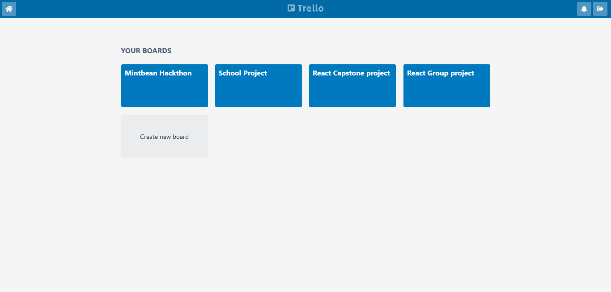

# Trello School

> Trello Board designed for schools



Trello School is a variant of trello board designed to make it easier for students and teachers to collaborate.

## Features

- Users: Students and Teachers
- Board: Each user has a single board
- List: User can create lists or pin other users' lists on their board
- Notification: List members get notified whenever a pinned list is updated
- Chat: Each list item has a chat section

## Built With

- React
- Redux

## Live Demo

[Live Demo Link](https://sleepy-bose-508e6f.netlify.app/)

## Getting Started

To get a local copy up and running follow these simple example steps.

### Prerequisites

- NodeJS - [v16.x](https://nodejs.org/en/)
- [Yarn](https://yarnpkg.com/)

### Setup

```bash
git clone https://github.com/usmansbk/trello-school.git
cd ./trello-school
```

### Install

```bash
yarn 
```

### Usage

```bash
yarn start
```

### Build

```bash
yarn build
```

### Run tests

```bash
yarn test
```

## Authors

👤 **Babakolo Usman Suleiman**

- GitHub: [@usmansbk](https://github.com/usmansbk)
- LinkedIn: [LinkedIn](https://www.linkedin.com/in/usmansbk/)

## 🤝 Contributing

Contributions, issues, and feature requests are welcome!

Feel free to check the [issues page](../../issues/).

## Show your support

Give a ⭐️ if you like this project!

## Acknowledgments

- Trello
